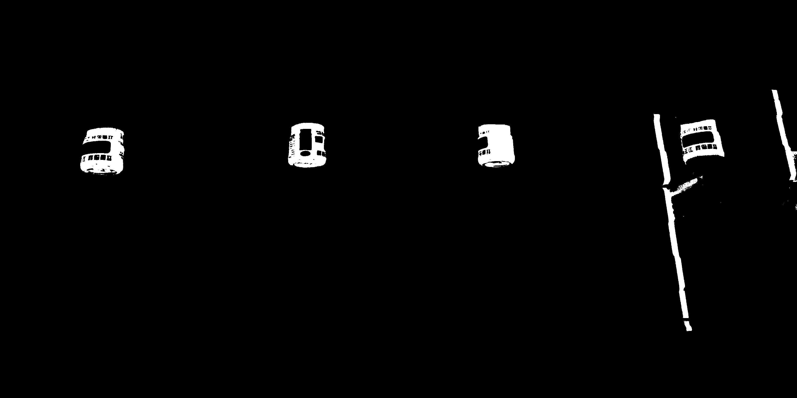

# 水桶识别小系统

## 系统简介
该系统主要功能为自动拍摄当前水桶照片，识别当前未开封的水桶数量，并将当前水桶数量数据推送到钉钉，以提醒同学及时订水。

## 文件说明
main.js: 主文件，负责设备接入阿里云、数据上报；
getBucket.js: 负责调用Python脚本，拍照并获取未开封水桶数量；
getBucketNum.py: 算法的主要实现，基于OpenCV，获取当前照片中未开封水桶数量；
temp: 临时文件夹，存储图片处理过程中产生的中间数据

## 水桶识别算法简介
该算法主要检测当前图片中未开封水桶的数量，水桶的照片如下。可以看到，未开封水桶的一个主要特点在于水桶口的红色贴纸，我们就通过识别红色贴纸部分来实现未开封水桶的识别。


水桶识别用到的主要算法参考了车牌定位的相关算法，详细信息可见参考文献部分。算法的步骤如下。
1. 将水桶照片由RGB空间转换为HSV空间。HSV空间是针对用户观感的颜色模型，有利于根据颜色区分水桶出口部分的贴纸。（RGB空间与HSV空间的详细介绍请参考网上资料）
    ```
    hsv_img = cv2.cvtColor(img, cv2.COLOR_BGR2HSV)
    ```
2. 图片二值化。设置颜色范围，将不在该颜色范围的像素点全部置0，在颜色范围的像素点全部置1。处理后的图片如下。
    ```
    in_range_array = cv2.inRange(hsv_img, lower_red, higher_red)
    ```
    

3. 执行一次闭操作。闭操作的概念请参考网上资料。闭操作的目的主要是填充图形中的细小空洞处理后的图片如下所示。
    ```
    closed = cv2.morphologyEx(in_range_array, cv2.MORPH_CLOSE, element_close)
    ```
    
4. 执行一次开操作。开操作的主要作用是去除细小的噪点。处理后的图片如下所示。
    ```
    opened = cv2.morphologyEx(closed, cv2.MORPH_OPEN, element_open)
    ```
    
5. 再次执行一次闭操作。此次闭操作的主要目的在于重新填补图形中的细小空洞，完整截取出水桶瓶口贴纸的形状。处理后的图片如下所示。
    ```
    closed2 = cv2.morphologyEx(opened, cv2.MORPH_CLOSE, element_close2)
    ```
    
6. 在上述图片的基础上，查找符合条件的矩形区域，统计未开封水桶个数。

## 运行
我们基于树莓派3B+，说明系统的运行流程（默认Node.js、Python3、OpenCV已安装完成）
1. 配置摄像头模块
2. 安装阿里云Node.js SDK
3. 在阿里云IoT平台上注册设备并开发云服务（可视化开发，相对简单，在此不再赘述，读者可参考阿里云IoT文档）

## 参考文章
http://qgxiaojin.com/2017/04/15/%E5%9F%BA%E4%BA%8Epython3-x-opencv3%E7%9A%84hsv%E9%A2%9C%E8%89%B2-%E8%BD%AE%E5%BB%93%E6%B3%95%E8%BD%A6%E7%89%8C%E7%B2%97%E5%AE%9A%E4%BD%8D/